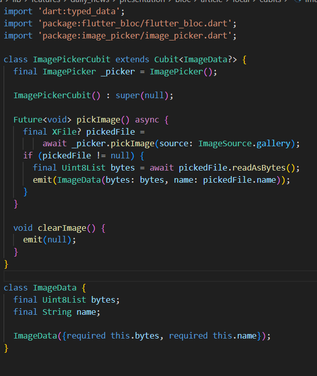

# App Report

### 1. Introduction

Embarking on this project was a journey of exploration and personal growth. Every line of code, every challenge, and every unexpected twist became a canvas for creativity and innovation. I approached each hurdle with a mindset that viewed problems as opportunities—opportunities to learn, adapt, and push my boundaries. This project is a reflection of my passion for turning challenges into stepping stones, creating something meaningful while constantly evolving as a developer.

### 2. Learning Journey

"Activated focus mode" was the first notification, and not only in my devices; but it stated the beginning of my process... I knew the time was short, but I could work to make it **enough**.
Then it started: the first flutter-practice app, then the first couple errors, then more flutter, then firebase, mix firebase and flutter, more errors, more **learning**... bloc, cubits, firestore, cloud, consoles, and architecture (achilles tendon).

When facing firebase and firestore and storage, discovered things like CORS rules

But the **actual learning**, arrived in the development process. Yes, the momentum was there, and never before had I imagined finding what I found when developing the app. Because facing the **struggle** generates the real learning, and the real experience. Just take a look on how was that process for me in the next section...

### 3. Challenges Faced

Deep breath taken, brain aimed, first clone, first build, first error. Right from the start, it was clear that the project wouldn’t be a walk in the park. The dependencies were old, and my machine’s Flutter version was installed globally—a remnant from my earlier flutter-practice days. When the "update dependencies" option decided to crash the party, I was forced into a migration. Enter the magic spell: FVM (Flutter Version Manager). Just say its name, and suddenly, things started to work. [Learn the spell here](https://fvm.app/)

Project had old dependencies, which caused a **mess**. And the only option provided by the log (and a LONG research) was migration of the project. So I did it. And it worked (Nobel prize to fvm, again).

Then came the big (O)ne: backend, architecture, logic, thinking, data (I come from frontend, so hell yeah, I was out of my comfort zone).
But honestly, I utterly enjoyed the architecture implementation (domain, presentation, data). Because finally, I was, at least, **understanding**. It was really fulfilling, and significative because it taught me that thinking before coding is a MUST, not an option when developing.

Then came a twist: I wanted a preview of images before actually submitting them to Firebase. In a web environment, where the browser doesn’t play by the rules of local file access, this meant getting creative. Thanks to Flutter’s [Uint8List](https://api.flutter.dev/flutter/dart-typed_data/Uint8List-class.html) (fixed-length list of 8-bit unsigned integers), I could convert local images into a lightweight, preview-friendly format. A tweak that felt like magic at the time—suddenly, the add_article page was not just functional, but delightful.

And just when I thought I had it all figured out, Firebase introduced its own little party pooper: [CORS](https://aws.amazon.com/what-is/cross-origin-resource-sharing/). Imagine hosting a party in Firebase's house, but your invitation got lost somewhere in the mail. With CORS rules acting like a bouncer, I had to convince Firebase I belonged. Enter [gsutil](https://cloud.google.com/storage/docs/gsutil?hl=es-419) to help smooth things over. Once I got past this, the project began to really come together, each struggle a stepping stone to deeper understanding.

Every error and unexpected twist added layers of insight and resilience to my development journey—a reminder that sometimes, the best lessons are learned when you’re in the thick of the struggle.

### 4. Reflection and Future Directions

There’s something called technical debt—it’s like that nagging feeling you get when you ignore your grandma’s advice. In this project, that debt showed up mostly as dependency nightmares and a lack of early DevOps practices. I learned the hard way that if you don’t nurture your project from the start, those early shortcuts can come back to bite you later.

Looking ahead, my future plans include taming that technical debt by embracing containerization. This isn’t just for show—it’s a necessary step to ensure the project runs smoothly, no matter where or how it’s deployed. Implementing a more robust DevOps pipeline is also on the horizon, promising to cut down on future headaches and let me focus more on crafting great features rather than fighting configuration gremlins.

Every twist in this journey, from battling old dependencies to charming Firebase with gsutil, has taught me that the real magic happens when you confront challenges head-on. And with these lessons in my toolkit, I’m excited to push forward, refining and expanding this project for both myself and future collaborators.

### 5. Proof of the project

Here you have a video of the project, enjoy! [Video of the project](https://www.youtube.com/watch?v=WmQIoe_KLvs)

### 6. Overdelivery

- # New Features Implemented
- Image Preview Functionality:
- Implemented a feature that allows users to preview images before uploading them. By leveraging Flutter's Uint8List, the application efficiently converts local images into a format suitable for browser preview, ensuring that users can view and confirm their image selection before submission.

- # UI Improvements:

  Several enhancements were made to the user interface to improve overall user experience. These improvements include refined layouts, smoother transitions, and more intuitive interaction elements, resulting in a more polished and user-friendly design.

- # Potential Improvements
- Additional Image Handling Options:
- Future enhancements could include features such as image cropping, filtering, or real-time adjustments to further enhance the preview functionality.

- # Further UI Enhancements:
  Continued focus on responsive design and user feedback can lead to additional UI improvements, ensuring the application remains modern and accessible across all devices.

### 7. Extra Sections

Below is an example code snippet that demonstrates how the image preview functionality is implemented using Flutter Bloc's Cubit for state management. This snippet shows how an image is picked from the gallery, converted into a preview-friendly Uint8List, and then emitted as a new state:

